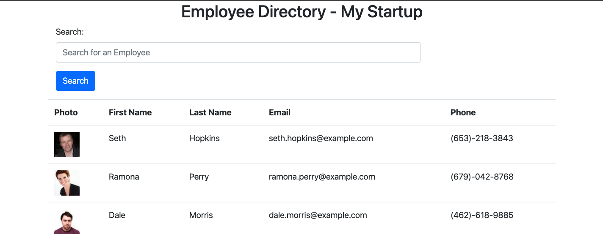
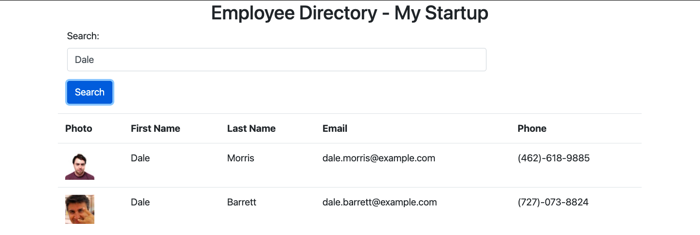

# Employee Directory Using React

Employee directory using React for frontend UI. Backend data was pulled from random user API.

App url - http://arorark77.github.io/emp-dir-react

## Usage

### In Dev Mode

```
npm install && npm start
```

### Deploy App to prod

```
npm run deploy
```

## App Pages

### Main App Pages





## Observations and Learning opportunity

This was a very good assignment and provided an introduction and opportunity to work on react.

